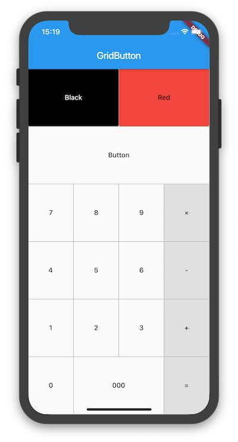

# flutter_grid_button

Flutter widget that arrange buttons in a grid.




## Getting Started

To use this plugin, add `flutter_grid_button` as a [dependency in your pubspec.yaml file](https://flutter.io/platform-plugins/).

```yaml
dependencies:
 flutter_grid_button: 
```

Import the library in your file.

````dart
import 'package:flutter_grid_button/flutter_grid_button.dart';
````

See the `example` directory for a complete sample app using GridButton.
Or use the GridButton like below.

````dart
GridButton(
  onPressed: (String value) {
    /*...*/
  },
  items: [
    [
      GridButtonItem(title: "1"),
      GridButtonItem(title: "2"),
      GridButtonItem(title: "3", flex: 2),
    ],
    [
      GridButtonItem(title: "a", value: "100"),
      GridButtonItem(title: "b", color: Colors.lightBlue)
    ],
  ],
)
````